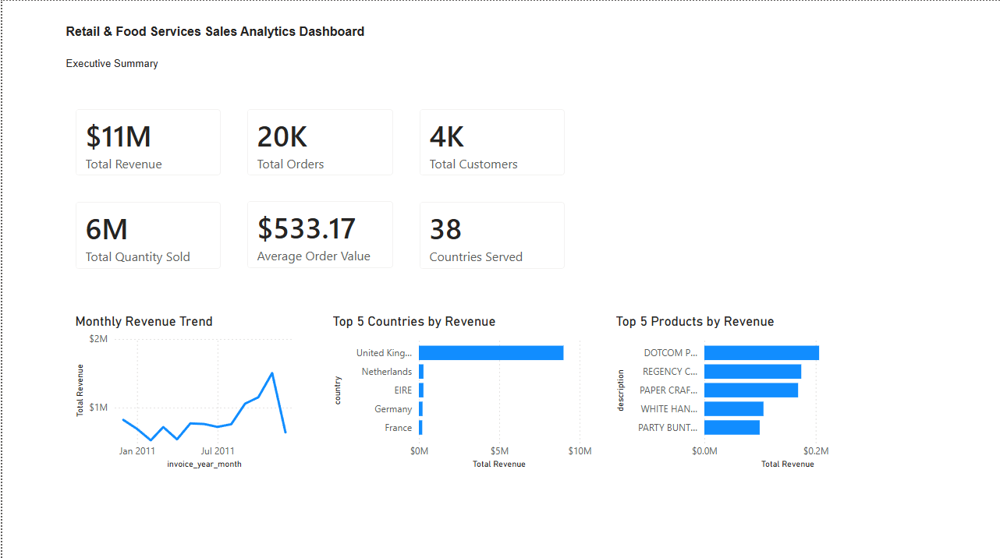
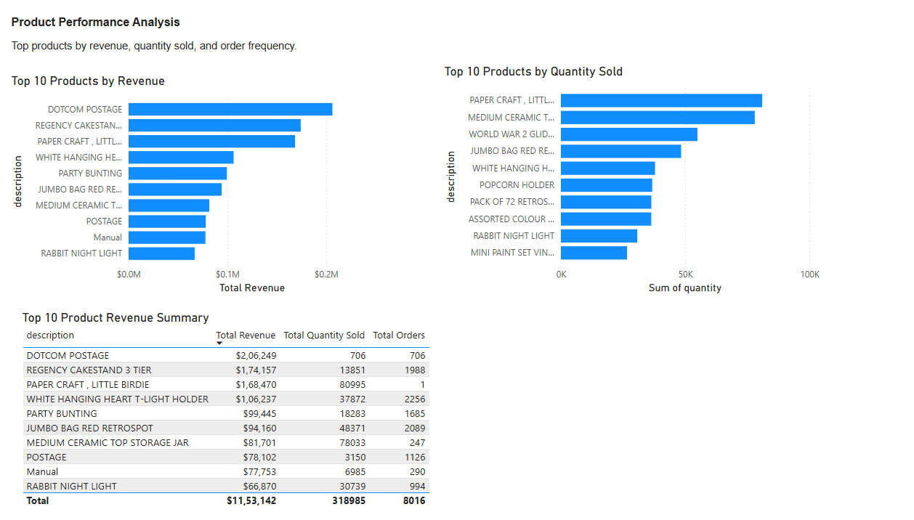
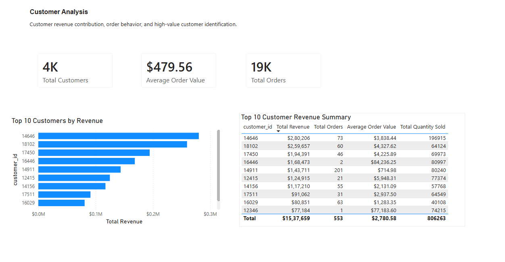
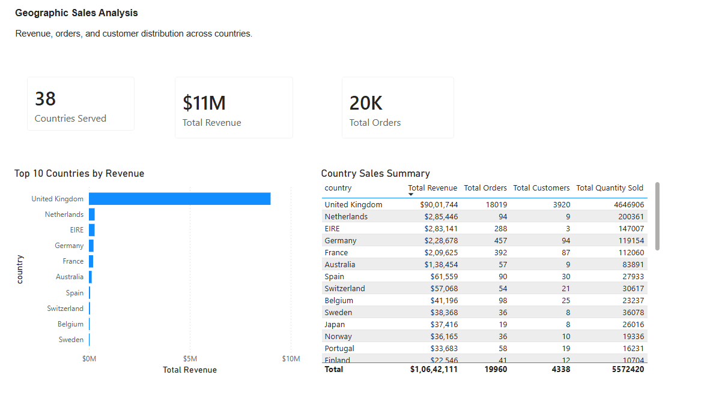

# Retail & Food Services Sales Analytics Dashboard

## Project Overview

This project analyzes transaction-level retail sales data to identify revenue trends, product performance, customer purchasing behavior, and geographic sales patterns.

The goal was to build an end-to-end business intelligence project using Python, SQL, SQLite, and Power BI. The final dashboard helps stakeholders understand sales performance, top products, high-value customers, and country-level revenue contribution.

---

## Business Problem

Retail and food service businesses need clear visibility into sales performance across products, customers, countries, and time periods.

This project answers key business questions such as:

- Which products generate the most revenue?
- Which customers contribute the most sales?
- Which countries drive the highest revenue?
- How do sales change over time?
- What products should receive inventory or promotional focus?

---

## Dataset

**Dataset:** Online Retail Dataset  
**Source:** UCI Machine Learning Repository  

The dataset contains transaction records from a UK-based online retail business. It includes invoice details, product descriptions, quantities, invoice dates, unit prices, customer IDs, and countries.

---

## Tools Used

- Python
- Pandas
- NumPy
- SQLite
- SQL
- Power BI
- DAX
- GitHub

---

## Project Workflow

1. Downloaded and reviewed the raw transaction dataset
2. Cleaned the data using Python and Pandas
3. Removed cancelled transactions, invalid quantities, invalid prices, duplicates, and missing product descriptions
4. Created calculated fields such as total revenue, invoice month, invoice hour, and known customer flag
5. Exported cleaned CSV files for analysis
6. Loaded the cleaned dataset into SQLite
7. Ran SQL analysis queries for business insights
8. Built a multi-page Power BI dashboard
9. Generated an automated business insights report
10. Published project files and dashboard screenshots to GitHub

---

## Key Metrics

| Metric | Value |
|---|---:|
| Total Revenue | $10.64M |
| Total Orders | 19,960 |
| Known Customers | 4,338 |
| Total Quantity Sold | 5.57M |
| Average Order Value | $533.17 |
| Countries Served | 38 |

---

## Dashboard Pages

The Power BI dashboard contains four pages:

1. **Executive Summary**
   - Total revenue
   - Total orders
   - Total customers
   - Quantity sold
   - Average order value
   - Countries served
   - Monthly revenue trend
   - Top countries by revenue
   - Top products by revenue

2. **Product Performance**
   - Top 10 products by revenue
   - Top 10 products by quantity sold
   - Product-level revenue summary table

3. **Customer Analysis**
   - Known customer metrics
   - Top 10 customers by revenue
   - Customer revenue summary table

4. **Geographic Analysis**
   - Country-level revenue
   - Orders by country
   - Customer distribution by country
   - Quantity sold by country

---

## Dashboard Preview

### Executive Summary



### Product Performance



### Customer Analysis



### Geographic Analysis



---

## Key Business Insights

### 1. Revenue is highly concentrated in the United Kingdom

The United Kingdom generated the majority of total revenue, making it the primary market for this retail business.

### 2. A small group of products drive a large share of revenue

The top revenue-generating products include items such as DOTCOM POSTAGE, REGENCY CAKESTAND, and PAPER CRAFT products.

### 3. High-value customers have strong revenue contribution

The customer analysis page identifies the top revenue-contributing customers, helping the business focus on retention and loyalty strategies.

### 4. Sales show visible monthly variation

Monthly revenue trends show periods of growth and decline, which can help with inventory planning, seasonal promotions, and demand forecasting.

### 5. Product quantity sold and revenue do not always move together

Some products sell in high volume but generate lower revenue, while others produce strong revenue with fewer units sold.

---

## Business Recommendations

1. **Prioritize high-revenue products**  
   Focus inventory planning, promotions, and product placement around the highest revenue-generating products.

2. **Strengthen customer retention efforts**  
   Use high-value customer insights to design loyalty programs and targeted offers.

3. **Monitor geographic revenue concentration**  
   Since revenue is concentrated heavily in the United Kingdom, the business should protect its core market while exploring growth in other regions.

4. **Use monthly trends for demand planning**  
   Monthly sales patterns can guide inventory purchasing, staffing, and campaign timing.

5. **Compare revenue and quantity metrics together**  
   Products with high quantity sold but lower revenue may need pricing review, bundling, or margin analysis.

---

## Repository Structure

```text
retail-food-services-sales-dashboard/
│
├── README.md
├── data/
│   ├── raw/
│   └── processed/
│
├── notebooks/
│   └── data_cleaning_and_eda.ipynb
│
├── sql/
│   └── retail_sales_analysis.sql
│
├── src/
│   ├── data_cleaning.py
│   ├── create_sqlite_database.py
│   ├── run_sql_analysis.py
│   └── generate_business_insights_report.py
│
├── reports/
│   ├── business_insights.md
│   └── sql_outputs/
│
├── dashboard/
│   ├── screenshots/
│   └── powerbi/
│
└── requirements.txt